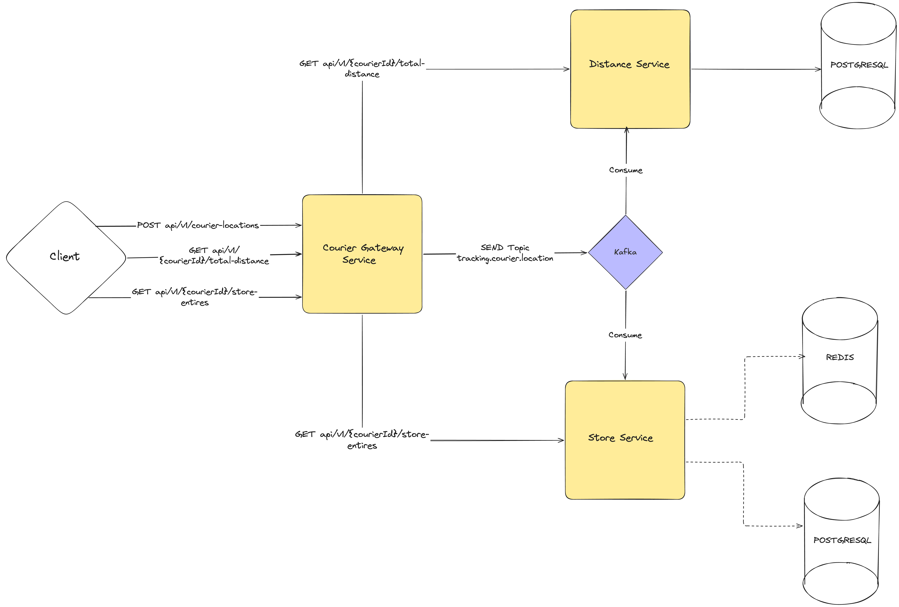

# Courier Tracking System

A real-time courier tracking system built with Java and Spring Boot. It receives courier location updates, detects store entries within a 100-meter radius, and calculates total travel distance per courier.

The project uses a **microservice architecture** with an **event-driven** flow over Kafka. Each service owns a clear part of the domain, so teams can scale, deploy, and change boundaries independently as business needs grow.



---

## Table of Contents

- [What It Does](#what-it-does)
- [Key Features](#key-features)
- [Architecture](#architecture)
- [Services](#services)
- [Tech Stack](#tech-stack)
- [Getting Started](#getting-started)
- [API](#api)
- [Demo Script](#demo-script)
- [Monitoring](#monitoring)
- [Known Limitations](#known-limitations)
- [Future Plans](#future-plans)
- [Shutdown](#shutdown)

---

## What It Does

- Accepts courier location pings (courier ID, latitude, longitude, time)
- Publishes location events to Kafka
- Calculates total travel distance per courier (Haversine or Manhattan strategy)
- Detects when a courier enters a store radius (100 m)
- Ignores re-entries to the same store within 60 seconds
- Exposes query APIs through a single gateway

### Business Rules

| Rule | Value |
|------|-------|
| Store entry radius | 100 meters |
| Re-entry cooldown | 60 seconds |
| Store list | Loaded from `stores.json` at startup |

---

## Key Features

### Event-Driven Processing
Location pings are accepted quickly and processed asynchronously. The gateway publishes to Kafka and returns `202 Accepted` without waiting for distance or store logic to finish. This keeps the write path fast under load.

### Resilience
- **Circuit breaker** on gateway Feign calls (distance-service, store-service). When a downstream API is down or slow, the gateway stops hammering it and returns `503` instead of hanging or cascading failures.
- **Producer retries** on Kafka publish 
- **Consumer retry** on processing errors (3 attempts, 500 ms apart).

### Observability
All services expose Prometheus metrics at `/actuator/prometheus`. This helps track system health as traffic grows:

| Metric area | What you can watch |
|-------------|-------------------|
| **Latency** | HTTP and Feign request durations |
| **Throughput** | Request rate per endpoint |
| **Saturation** | JVM memory, thread usage |
| **Kafka lag** | How far consumers are behind the producer |

### Other
- Per-courier ordering via Kafka partition key (`courierId`)
- Pluggable distance calculation (Haversine / Manhattan)
- Redis-based re-entry lock for store entries (60 s TTL)
- Docker Compose for one-command local setup
- Demo script (`./demo.sh`) for end-to-end scenario testing

---

## Architecture

### Why Microservices?

The system handles two very different workloads:

- **Write path:** High volume of location requests.
- **Read path:** Low volume of distance and store-entry queries.

A single monolith would mix these concerns. Splitting into services gives:

- Independent scaling
- Clear domain boundaries that map to DDD-style bounded contexts
- Freedom to change one area (stores, distance) without touching the rest.

In a high-traffic setup, services scale independently. The gateway handles ingestion, consumers scale with Kafka lag, and read APIs stay on their own path. Circuit breaker and Prometheus metrics are in place so failures and bottlenecks are visible early — before they take down the whole system.

---

## Services

| Service | Port | Responsibility |
|---------|------|----------------|
| `courier-gateway-service` | 8081 | HTTP ingestion, Kafka publish, query proxy, Swagger UI |
| `distance-service` | 8082 | Consumes locations, calculates and stores total distance |
| `store-service` | 8083 | Consumes locations, detects store entries, serves entry history |

---

## Tech Stack

- Java 21
- Spring Boot 4.1
- Spring Cloud OpenFeign + Resilience4j (circuit breaker on gateway)
- Apache Kafka
- PostgreSQL
- Redis 7.4
- Docker & Docker Compose
- Maven
- SpringDoc OpenAPI
- Micrometer + Prometheus

---

## Getting Started

### Prerequisites

- Docker Desktop (or any Docker engine)
- Java 21 (only needed for local development without Docker)

### Option 1: Docker Compose (recommended)

Starts infrastructure and all three microservices:

```bash
docker compose up --build
```

First build may take a few minutes (Maven downloads dependencies inside Docker).

Swagger UI: http://localhost:8081/swagger-ui.html

### Option 2: Local Development

1. Start infrastructure only:

```bash
docker compose up postgres redis kafka -d
```

2. Run each service:

```bash
cd "courier-gateway-service " && ./mvnw spring-boot:run
cd "distance-service "       && ./mvnw spring-boot:run
cd "store-service "          && ./mvnw spring-boot:run
```

### Seed Data

On first startup, PostgreSQL runs `scripts/init.sql` and creates two test couriers:

| ID | Name |
|----|------|
| `courier-1` | Test Courier 1 |
| `courier-2` | Test Courier 2 |

(There is no user service yet. Therefore, we can test using mock courier data.)

---
## API

All client traffic goes through the gateway.

### Submit Location

```http
POST /api/v1/courier-locations
Content-Type: application/json

{
  "courierId": "courier-1",
  "latitude": 40.9923307,
  "longitude": 29.1244229,
  "time": "2024-07-03T13:46:40Z"
}
```

```bash
curl -X POST http://localhost:8081/api/v1/courier-locations \
  -H "Content-Type: application/json" \
  -d '{"courierId":"courier-1","latitude":40.9923307,"longitude":29.1244229,"time":"2024-07-03T13:46:40Z"}'
```

### Get Total Distance

```http
GET /api/v1/courier-locations/{courierId}/total-distance
```

### Get Store Entries

```http
GET /api/v1/courier-locations/{courierId}/store-entries
```

Full interactive docs: http://localhost:8081/swagger-ui.html

### Kafka Topic

| Topic | Key | Payload |
|-------|-----|---------|
| `tracking.courier.location` | `courierId` | `eventId`, `courierId`, `lat`, `lng`, `time` |

---

## Demo Script

A helper script runs a full scenario: courier moves toward Ataşehir Migros, triggers a store entry, tests re-entry skip, and prints query results.

```bash
./demo.sh              # infra + services + scenario
./demo.sh up           # start everything
./demo.sh scenario     # run scenario only (services must be running)
./demo.sh status       # check what is running
./demo.sh down         # stop everything
```

---

## Monitoring

All services expose health and Prometheus endpoints:

```bash
curl http://localhost:8081/actuator/prometheus
curl http://localhost:8082/actuator/prometheus
curl http://localhost:8083/actuator/prometheus
```

```bash
docker compose logs -f courier-gateway-service
docker compose logs -f distance-service
docker compose logs -f store-service
```

---

## Future Plans

### User Service
Add a dedicated service for courier registration and lifecycle. Remove hardcoded seed couriers from `init.sql`.

### Location History / Audit Log
Store every location request in a separate log table or stream it to an analytics store (e.g. BigQuery).

### Separate Databases
Move from one shared PostgreSQL to database-per-service. Each microservice gets its own schema or database instance.

### Shared Distance Library
Extract `DistanceStrategy` (Haversine, Manhattan) into a common library so distance-service and store-service do not duplicate the same code.

### Kubernetes Deployment
Package services as containers and deploy to Kubernetes. Add horizontal pod autoscaling.

### Retry Topics with Exponential Backoff
Replace the current in-process retry with a proper retry topic and dead-letter topic (DLT). Use exponential backoff with jitter after 3 failed attempts.

### Outbox Pattern
Implement an Outbox table to ensure atomicity between database updates and Kafka events. A background worker processes pending records, guaranteeing that database commits and event delivery stay in sync even if the service fails.

---

## Shutdown

```bash
# Stop all containers
docker compose down

# Stop and remove volumes (resets database)
docker compose down -v
```

